```mermaid
graph TD
    A[PR Created/Updated] --> B{Quick Lint Check}
    B -->|✅ Pass| C[Main CI Pipeline]
    B -->|❌ Fail| Z[❌ Block Merge]
    
    C --> D[ESLint + TypeScript]
    C --> E[Build Application]
    C --> F[Security Audit]
    
    A --> G[Feature Tests]
    G --> H[API Routes Check]
    G --> I[GitHub Integration Test]
    G --> J[Notion Webhook Test]
    G --> K[Blog Generation Test]
    G --> L[Project Pages Test]
    
    A --> M[Code Quality & Security]
    M --> N[Dependency Review]
    M --> O[Vulnerability Scan]
    M --> P[Bundle Analysis]
    M --> Q[Performance Check]
    
    A --> R[Unit Tests]
    R --> S[Test Execution]
    R --> T[Component Validation]
    
    D -->|✅| U{All Checks Pass?}
    E -->|✅| U
    F -->|✅| U
    H -->|✅| U
    I -->|✅| U
    J -->|✅| U
    K -->|✅| U
    L -->|✅| U
    N -->|✅| U
    O -->|✅| U
    P -->|✅| U
    Q -->|✅| U
    S -->|✅| U
    T -->|✅| U
    
    U -->|✅ Yes| V[✅ Ready to Merge]
    U -->|❌ No| Z
    
    V --> W[Merge to Main]
    W --> X[Deploy to Production]
    
    style A fill:#e1f5fe
    style V fill:#c8e6c9
    style Z fill:#ffcdd2
    style W fill:#dcedc8
    style X fill:#f3e5f5
```

# GitHub Actions Workflow Flow

This diagram shows how the different workflows interact when a pull request is created or updated.

## Workflow Execution Order

1. **Quick Lint Check** runs immediately for fast feedback
2. **Main CI Pipeline** performs core validation (lint, build, security)
3. **Feature Tests** validate application-specific functionality in parallel
4. **Code Quality & Security** performs deep analysis
5. **Unit Tests** execute test validation

## Branch Protection Strategy

### Required Status Checks (Recommended)
- ✅ `Continuous Integration` (main CI)
- ✅ `Quick Lint & Type Check` (fast feedback)
- ✅ `Test Key Features` (functionality validation)

### Optional but Recommended
- `Security Audit` (from Code Quality workflow)
- `Build Application` (redundant with CI but good for visibility)

## Workflow Features

### 🚀 **Fast Feedback**
- Quick lint check runs in ~2-3 minutes
- Immediate TypeScript validation
- Early failure prevents wasted CI time

### 🔍 **Comprehensive Testing**
- API route structure validation
- GitHub/Notion integration testing
- Blog generation system verification
- Project page functionality checks

### 🛡️ **Security & Quality**
- Dependency vulnerability scanning
- License compliance checking
- Bundle size monitoring
- Sensitive data leak detection
- Performance anti-pattern detection

### 📊 **Monitoring & Reporting**
- Detailed GitHub Step Summaries
- Build artifact preservation
- Performance metrics tracking
- Security audit results

## Configuration Files

| File | Purpose |
|------|---------|
| `ci.yml` | Main CI pipeline - single status check |
| `quick-lint.yml` | Fast linting for immediate feedback |
| `pr-tests.yml` | Comprehensive testing suite |
| `feature-tests.yml` | Application functionality validation |
| `code-quality.yml` | Security and quality analysis |
| `unit-tests.yml` | Test execution framework |